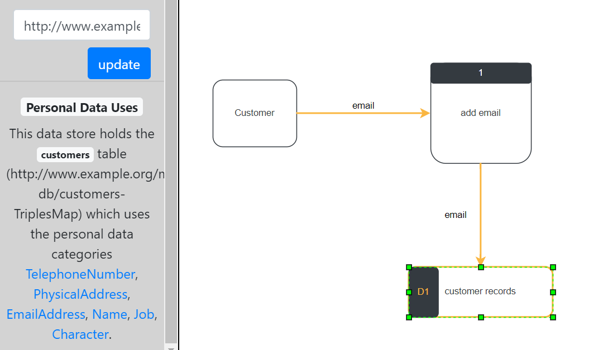
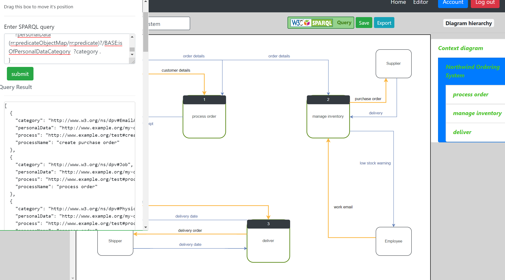

# DFD_Edit Extension for GDPR-aware DFD Modelling

This is an extension of the [base DFD Edit application](https://github.com/SeanFitz1997/DFD_EDIT) to demonstrate the ability for the Linked Data representation of the users DFD to integrate with an RDF representation of their database and with GDPR personal data category definitions. See my report for more details.

The live site can be be accessed **[Here](http://dfdedit.com/)**.

## Screen Shots

### Identify uses of Personal Data
This extension will allow the user to annotate the data flows and data stores in their DFD with the URI of a column or table in their database.



### Query the Knowledge Base
By representing the user's DFD and it personal data uses as Linked Data, we can query this Knowledge Base using SPARQL.
Press the 'Query' button to show a form where you can input SPARQL that you can then execute. This feature will highlight all the items that you select in your query and display the result as JSON.



## Run Local

#### Download the code and navigate to this directory.

```bash
git clone https://github.com/SeanFitz1997/DFD_Edit
cd DFD_Edit
```

#### Install dependencies
* Requires python 3.6 (or higher)
* Requires [pipenv](https://pypi.org/project/pipenv/)
```bash
pipenv install
```

#### Create a secret key

`Option 1: Set a environment variable`

```bash
(If using bash)
$vim ~/.bashrc
#add to bottom of the file
export DFD_EDIT=<RANDOM-VALUE>
```

If windows see [here](http://www.dowdandassociates.com/blog/content/howto-set-an-environment-variable-in-windows-command-line-and-registry/)

`Option 2: Add secret key to App/__init__.py`
Change this line to
```Python
app.config['SECRET_KEY'] = "<RANDOM-VALUE>"
```

I recommend to create your random value using
```bash
$ python
Python 3.6.5 (v3.6.5:f59c0932b4, Mar 28 2018, 17:00:18) [MSC v.1900 64 bit (AMD64)] on win32
Type "help", "copyright", "credits" or "license" for more information.
>>> import secrets
>>> secrets.token_urlsafe(16)
'<SECRET>'
```

#### Create Database
This will create a sqlite DB in `App/site.db` and populate it with some demo users and demo DFDs. You can long in with to these accounts with the email: 'test_user1@test.com' (or 2, 3 for the other users) and password 'test'. 
```bash
python create_db.py
```

#### Run server
```bash
python run.py
```

This will allow you to access the site at http://127.0.0.1:5000

## Whats Here
```
App
|-rdf-graphs
|   |- database_r2rml_mapping.ttl (RDF representation of the database)
|   |- personal_data.ttl (DB annotations of personal data catagories)
|-static
|   |- img (site images)
|   |- js
|       |-editor (code for editor page)
|           |- config (key bindings for editor)
|           |- images (images used in editor)
|           |- main.js (contains main function to create editor and diagram hierarchy data structure)
|           |- editor.js (creates editor)
|           |- diagram_hierarchy.js (diagram hierarchy getters & setters and diagram switch event handlers)
|           |- validator.js (validation helper functions)
|           |- save_graph.js (functions for serializing DFD and making save and export requests)
|           |- compliance_analysis.js (functions annotation DFD and highlight personal data)
|           |- sparql_query.js (functions to send SPARQL query requests and display results)
|       |- account.js (Handles users interactions on the account page)
|   |- mxgraph-master (mxgraph library used for drag & drop diagram)
|   |- styles (Custom CSS)
|- templates
|- use_case_queries (Sample SPARQL queries and JSON output)
|- __init__ (App constructor)
|- models.py (Data models)
|- routes.py (Route definitions)
|- forms.py (Form definitions)
|- exporter.py (RDF export functions)
|- compliance_analysis.py (Execute users query and personal data uses)
|- utils.py (Helper functions)
create_db.py (Creates tables and fill with demo data)
run.py (Runs server in debug mode)
```
